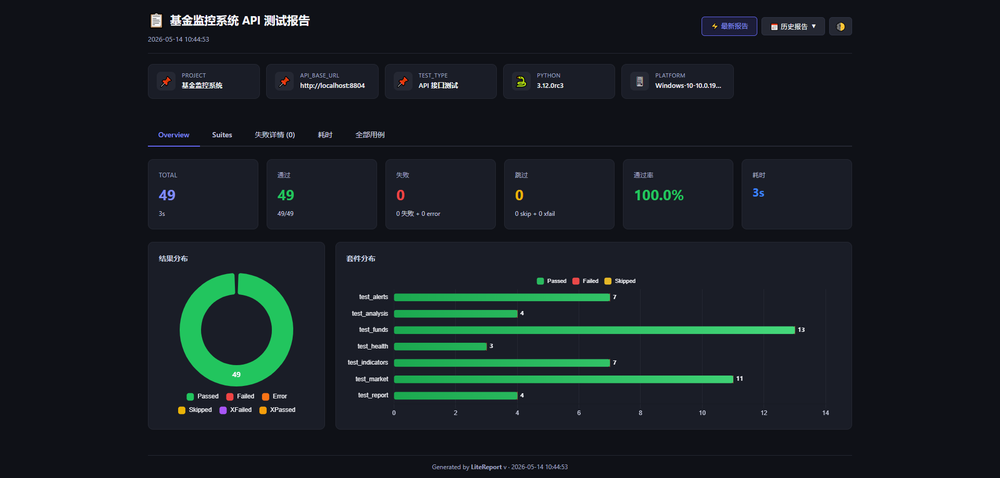
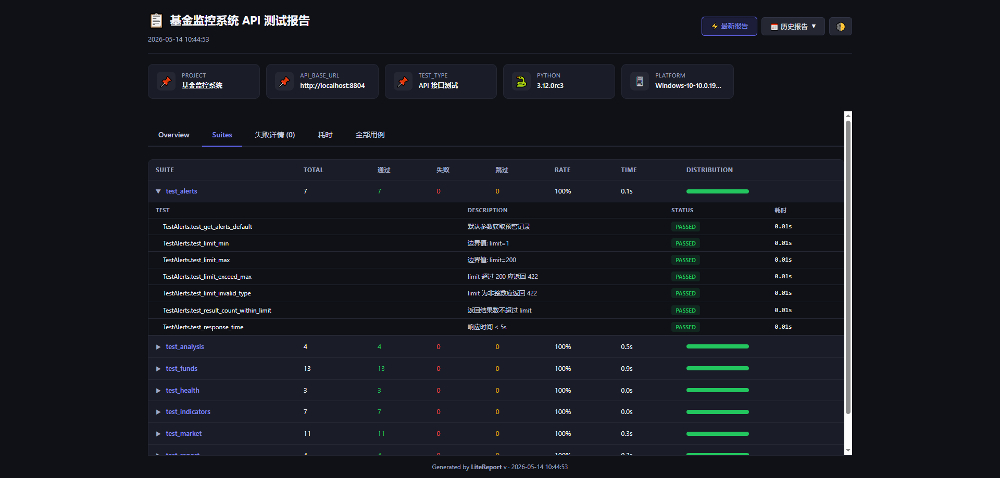
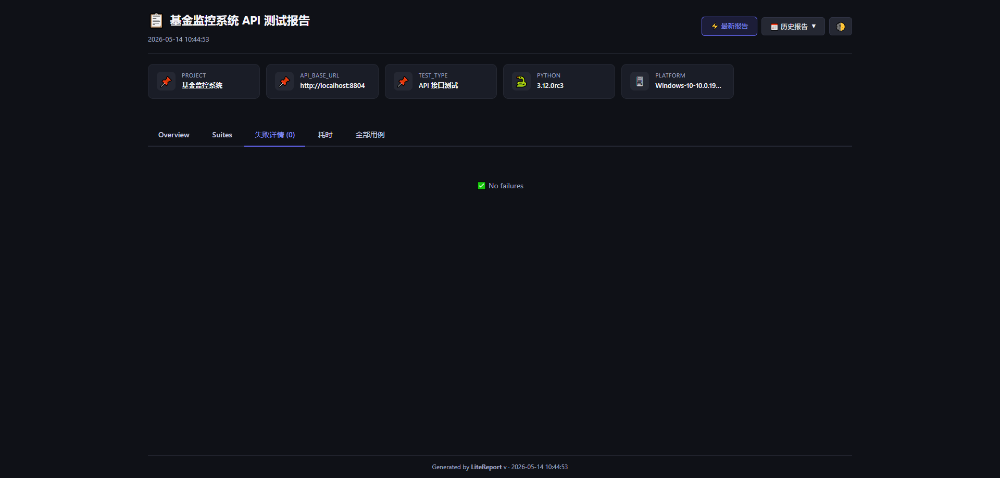
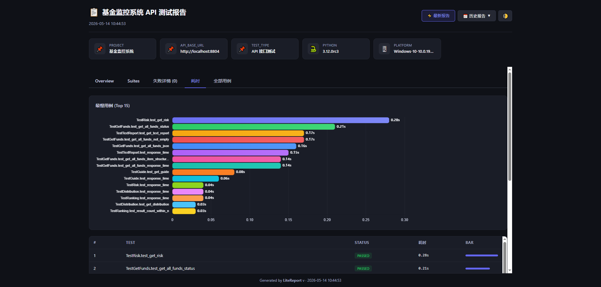
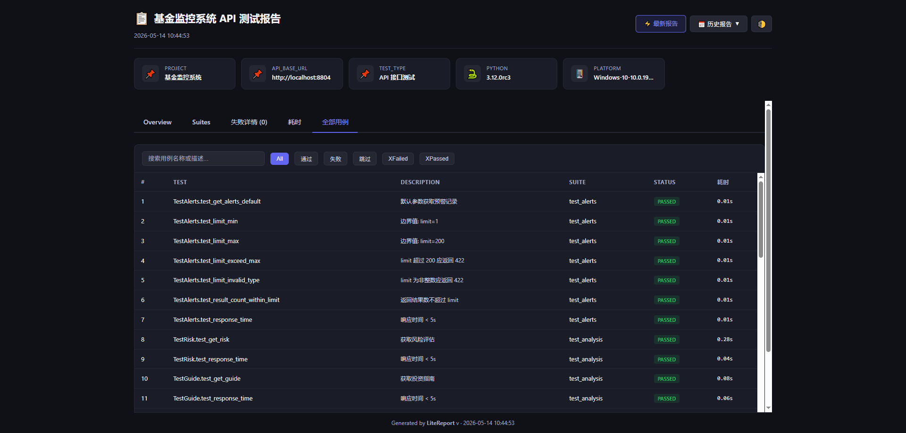

# 【开源LiteReport】告别 JDK 依赖 -- 用 LiteReport 为 pytest 项目打造轻量级测试报告

> 一行命令，一个 HTML 文件，零额外依赖。

## 写在前面：测试报告的痛

如果你的团队在用 Python + pytest 做自动化测试，大概率遇到过这个问题：**测试跑完了，然后呢？**

终端里那一屏绿色的 PASSED 固然让人安心，但当你需要把测试结果同步给团队、归档到 CI/CD、或者回溯上周的测试状态时，纯文本输出就显得力不从心了。

于是你可能考虑过 Allure -- 业界最知名的测试报告框架。它确实强大，但用过之后你会发现：

- **必须装 JDK**。Python 项目要跑报告，先装个 Java 运行时？不少团队在这一步就劝退了。
- **安装链路长**。`allure-pytest` 只负责采集数据，生成报告还需要单独安装 Allure CLI（通过 npm、brew 或手动下载）。
- **报告不能直接打开**。`allure generate` 生成的是一个多文件目录，必须 `allure open` 启动 HTTP 服务才能查看。
- **CI/CD 集成额外成本**。Jenkins 需要装 Allure 插件，GitLab CI 需要额外配置 artifacts 目录。

对于中小团队或个人项目来说，这些"重量"往往不值得。**我们需要的不是一个"报告平台"，而是一个"报告工具"** -- 轻量、快速、开箱即用。

## LiteReport：轻量到什么程度？

项目地址：https://pypi.org/project/litereport/

git地址：https://github.com/moduwusuowei/litereport

**LiteReport** 是一个专为 pytest 生态设计的轻量级测试报告工具。它的核心理念用一句话概括：

> **零 JDK、单 HTML 文件、离线可用。**


安装：

```python
pip install pytest litereport[pytest]
```

具体来说：

- **`pip install` 即装即用** -- 纯 Python 实现，不依赖 Java、Node.js 或任何外部二进制
- **`pytest --litereport` 一键生成** -- 作为 pytest 插件，加一个参数就能自动生成报告
- **单个 HTML 文件** -- 报告是一个完全自包含的 HTML，双击浏览器打开即可
- **明暗主题切换** -- 支持 Light / Dark 两种主题，运行时一键切换，自动记忆偏好
- **中英双语** -- `lang: "zh"` 或 `lang: "en"`，国际化团队友好
- **历史追踪** -- 自动保存每次运行快照，在报告中可浏览历史记录
- **Web UI 截图** -- 支持 Playwright 等工具逐步截图，base64 内嵌到报告中
- **树状截图视图** -- 每个 case 的截图以可折叠树状结构展示，标注步骤说明和截图原因
- **自动失败截图** -- 测试失败时自动捕获页面状态，⚠️ 标记区分手动/自动截图

## Allure vs LiteReport：一张表说清楚

| 维度 | Allure | LiteReport |
|------|--------|------------|
| 运行依赖 | JDK 8+ (版权问题) | Python 3.8+ |
| 安装方式 | pip + allure CLI (npm/brew) | `pip install litereport` |
| pytest 集成 | `allure-pytest` + `allure generate` 两步 | `pytest --litereport` 一步 |
| 报告查看 | 需 `allure open` 启动 HTTP 服务 | 双击 HTML 文件 |
| 报告体积 | 多文件目录（JS/CSS/JSON/HTML） | 单个 HTML 文件 |
| 截图支持 | `allure.attach` + 独立文件 | `screenshot()` 一行代码，base64 内嵌 |
| 离线使用 | 部分功能需 CDN 资源 | 完全自包含，断网可用 |
| CI/CD 产物 | 需 Allure 插件或额外配置 | 直接归档一个 HTML 文件 |
| 上手成本 | 高（JDK + CLI + 插件配置） | 低（一个 pip 命令） |

> 这不是说 Allure 不好 -- 它在大型企业级项目中有不可替代的优势（如与 TestOps 集成、自定义 step 等）。但如果你的需求是"跑完测试看个报告"，LiteReport 是更务实的选择。
>
> 版权问题：
>
> JDK 11之后会带来版权问题，部分公司可能不会去采购，这是开发该工具的一个主要因素。

## 真实项目一瞥：API 接口测试

先看一个真实案例。我们有一个基金监控系统，后端用 FastAPI 构建，提供 12 个 API 端点（健康检查、基金列表、技术指标、预警记录、大盘行情、投资分析等）。围绕这些接口，我们用 pytest + LiteReport 搭建了自动化测试，项目结构如下：

```
api-test/
├── conftest.py          # 共享 fixture
├── pytest.ini           # pytest 配置
├── litereport.yaml      # LiteReport 配置
├── requirements.txt     # 依赖: requests, pytest
├── gen_report.py        # 独立报告生成脚本
└── tests/
    ├── test_health.py       # 健康检查（3 条用例）
    ├── test_funds.py        # 基金接口（13 条用例）
    ├── test_indicators.py   # 技术指标（7 条用例）
    ├── test_alerts.py       # 预警记录（7 条用例）
    ├── test_market.py       # 大盘行情（7 条用例）
    ├── test_analysis.py     # 投资分析（7 条用例）
    └── test_report.py       # 持仓报告（5 条用例）
```

核心是 `conftest.py` 中的 fixture 设计 -- 用 session 级别的 `api_session` 保持连接复用，并在测试开始前自动校验 API 可达性：

```python
@pytest.fixture(scope="session")
def api_session(base_url):
    """Shared requests Session with connectivity check."""
    s = requests.Session()
    try:
        resp = s.get(f"{base_url}/health", timeout=5)
        assert resp.status_code == 200
    except Exception as e:
        pytest.exit(f"API 服务不可达: {base_url} ({e})")
    yield s
    s.close()
```

一条典型的测试用例长这样：

```python
class TestHealth:
    def test_health_check(self, api_session, base_url):
        """健康检查接口应返回 200"""
        resp = api_session.get(f"{base_url}/health")
        assert resp.status_code == 200
```

运行非常简单：

```bash
pytest --litereport -v
```

```
========= 49 passed in 3.42s =========
报告已生成: reports/report.html
```

49 条测试用例全部通过，一个漂亮的 HTML 报告自动出现在 `reports/` 目录下。这就是 LiteReport 在真实项目中的使用体验 -- **你不需要改变任何测试代码，只需要在 pytest 命令后加上 `--litereport`**。

当然，上面这个 API 测试项目需要实际运行的后端服务，你无法直接复现。接下来我们用一个更简单的例子，让你在 5 分钟内亲自体验 LiteReport。

### 测试生成页面

主页面：



Suits概览



失败用例：



耗时：



全部用例:



## 5 分钟上手：数学计算器测试

### Step 1：创建项目

```bash
mkdir calculator-test && cd calculator-test
python -m venv venv

# Windows
venv\Scripts\activate
# macOS / Linux
source venv/bin/activate

pip install pytest litereport[pytest]
```

### Step 2：被测代码

创建 `calculator.py`：

```python
"""简单的数学计算器模块"""


def add(a, b):
    """加法"""
    return a + b


def subtract(a, b):
    """减法"""
    return a - b


def multiply(a, b):
    """乘法"""
    return a * b


def divide(a, b):
    """除法"""
    if b == 0:
        raise ValueError("除数不能为零")
    return a / b
```

### Step 3：编写测试

项目结构目标：

```
calculator-test/
├── calculator.py           # 被测模块
├── litereport.yaml         # LiteReport 配置（可选）
└── tests/
    ├── conftest.py         # 共享 fixture
    ├── test_add.py         # 加法测试套件
    ├── test_subtract.py    # 减法测试套件
    ├── test_multiply.py    # 乘法测试套件
    └── test_divide.py      # 除法测试套件
```

注意这里的组织方式：**每个文件对应一个测试套件（test suite）**，在 LiteReport 的报告中会按套件维度展示结果分布。

---

#### 关于 test_suite 的组织原则

在写测试之前，先聊聊 test suite 怎么规划：

1. **按功能模块拆分文件** -- 每个 `test_xxx.py` 文件就是一个 suite。LiteReport 自动识别文件名作为套件名，所以文件拆分直接影响报告的可读性。
2. **用 class 对场景分组** -- 同一个功能的不同测试场景用 class 归类，比如 `TestDivideBasic` 和 `TestDivideEdgeCases`。
3. **命名规范**：
   - 文件名：`test_<模块>.py`
   - 类名：`Test<功能><场景>`
   - 方法名：`test_<具体行为>`

#### testcase 书写规范

好的测试用例应该覆盖这几个维度：

| 维度 | 说明 | 示例 |
|------|------|------|
| **docstring** | 用中文写清楚"这条用例验证什么"，LiteReport 会提取并展示在报告中 | `"""整数除法"""` |
| **正向测试** | 正常输入，验证正确输出 | `assert add(1, 2) == 3` |
| **边界测试** | 零、负数、大数、浮点数等边界值 | `assert add(0, 0) == 0` |
| **异常测试** | 非法输入应抛出预期异常 | `pytest.raises(ValueError)` |
| **参数化** | 多组数据复用同一逻辑，减少重复代码 | `@pytest.mark.parametrize(...)` |

---

下面是完整的测试代码。

**tests/conftest.py** -- 共享 fixture：

```python
"""共享 fixture"""
import sys
import os

# 将项目根目录加入 sys.path，确保能 import calculator
sys.path.insert(0, os.path.join(os.path.dirname(__file__), ".."))
```

**tests/test_add.py** -- 加法测试套件：

```python
"""加法运算测试套件"""
import pytest
from calculator import add


class TestAddBasic:
    """基础加法测试"""

    def test_add_positive(self):
        """两个正整数相加"""
        assert add(1, 2) == 3

    def test_add_negative(self):
        """两个负数相加"""
        assert add(-1, -2) == -3

    def test_add_mixed(self):
        """正数加负数"""
        assert add(5, -3) == 2


class TestAddEdgeCases:
    """加法边界测试"""

    def test_add_zero(self):
        """加零"""
        assert add(5, 0) == 5

    def test_add_float(self):
        """浮点数相加"""
        assert add(0.1, 0.2) == pytest.approx(0.3)

    @pytest.mark.parametrize("a,b,expected", [
        (100, 200, 300),
        (-100, 100, 0),
        (999999, 1, 1000000),
    ])
    def test_add_parametrize(self, a, b, expected):
        """参数化测试：多组数据验证"""
        assert add(a, b) == expected
```

**tests/test_subtract.py** -- 减法测试套件：

```python
"""减法运算测试套件"""
import pytest
from calculator import subtract


class TestSubtract:
    """减法测试"""

    def test_subtract_positive(self):
        """正整数相减"""
        assert subtract(5, 3) == 2

    def test_subtract_result_negative(self):
        """结果为负数"""
        assert subtract(3, 5) == -2

    def test_subtract_zero(self):
        """减零"""
        assert subtract(5, 0) == 5

    def test_subtract_self(self):
        """自身相减等于零"""
        assert subtract(42, 42) == 0

    @pytest.mark.parametrize("a,b,expected", [
        (100, 50, 50),
        (-10, -3, -7),
        (0, 0, 0),
    ])
    def test_subtract_parametrize(self, a, b, expected):
        """参数化测试"""
        assert subtract(a, b) == expected
```

**tests/test_multiply.py** -- 乘法测试套件：

```python
"""乘法运算测试套件"""
import pytest
from calculator import multiply


class TestMultiply:
    """乘法测试"""

    def test_multiply_positive(self):
        """正整数相乘"""
        assert multiply(3, 4) == 12

    def test_multiply_negative(self):
        """负数相乘"""
        assert multiply(-3, -4) == 12

    def test_multiply_mixed_sign(self):
        """正负相乘"""
        assert multiply(3, -4) == -12

    def test_multiply_by_zero(self):
        """乘以零"""
        assert multiply(100, 0) == 0

    def test_multiply_by_one(self):
        """乘以一"""
        assert multiply(42, 1) == 42

    @pytest.mark.parametrize("a,b,expected", [
        (0.5, 4, 2.0),
        (10, 10, 100),
        (-1, -1, 1),
    ])
    def test_multiply_parametrize(self, a, b, expected):
        """参数化测试"""
        assert multiply(a, b) == expected
```

**tests/test_divide.py** -- 除法测试套件（重点展示异常测试）：

```python
"""除法运算测试套件"""
import pytest
from calculator import divide


class TestDivideBasic:
    """基础除法测试"""

    def test_divide_integers(self):
        """整数除法"""
        assert divide(10, 2) == 5.0

    def test_divide_float_result(self):
        """结果为浮点数"""
        assert divide(7, 2) == 3.5

    def test_divide_negative(self):
        """负数除法"""
        assert divide(-10, 2) == -5.0


class TestDivideEdgeCases:
    """除法边界与异常测试"""

    def test_divide_by_zero(self):
        """除数为零应抛出 ValueError"""
        with pytest.raises(ValueError, match="除数不能为零"):
            divide(10, 0)

    def test_divide_zero_numerator(self):
        """被除数为零"""
        assert divide(0, 5) == 0.0

    def test_divide_by_one(self):
        """除以一"""
        assert divide(42, 1) == 42.0

    @pytest.mark.parametrize("a,b,expected", [
        (100, 3, 33.333333),
        (1, 7, 0.142857),
        (22, 7, 3.142857),
    ])
    def test_divide_precision(self, a, b, expected):
        """浮点精度验证"""
        assert divide(a, b) == pytest.approx(expected, rel=1e-4)
```

### Step 4：添加 LiteReport 配置（可选）

创建 `litereport.yaml`：

```yaml
report:
  title: "Calculator 测试报告"
  theme: "light"
  lang: "zh"

history:
  enabled: true
  max_entries: 30

output:
  dir: "./reports"
  filename: "report.html"

environment:
  project: "calculator-test"
  test_type: "单元测试"
```

> 不创建配置文件也能运行，全部使用内置默认值。配置文件的作用是自定义报告标题、主题、语言等。

### Step 5：运行并生成报告

```bash
pytest --litereport -v
```

终端输出类似：

```
tests/test_add.py::TestAddBasic::test_add_positive PASSED
tests/test_add.py::TestAddBasic::test_add_negative PASSED
tests/test_add.py::TestAddBasic::test_add_mixed PASSED
tests/test_add.py::TestAddEdgeCases::test_add_zero PASSED
tests/test_add.py::TestAddEdgeCases::test_add_float PASSED
tests/test_add.py::TestAddEdgeCases::test_add_parametrize[100-200-300] PASSED
tests/test_add.py::TestAddEdgeCases::test_add_parametrize[-100-100-0] PASSED
tests/test_add.py::TestAddEdgeCases::test_add_parametrize[999999-1-1000000] PASSED
...
tests/test_divide.py::TestDivideEdgeCases::test_divide_by_zero PASSED
tests/test_divide.py::TestDivideEdgeCases::test_divide_precision[100-3-33.333333] PASSED
...
========= 30 passed in 0.15s =========
```

打开 `reports/report.html`，你会看到一个完整的测试报告。

## 报告里有什么？

生成的报告不是简单的文本罗列，而是一个功能完整的单页应用：

**概览仪表盘**：页面顶部展示整体统计 -- 总用例数、通过数、失败数、跳过数，以及一个环形图直观展示结果分布（每个状态都有对应数字标注）。

**套件维度分析**：水平堆叠柱状图，按测试文件（suite）维度展示每个文件的通过/失败/跳过分布。在我们的例子中，你会看到 `test_add`、`test_subtract`、`test_multiply`、`test_divide` 四个套件各自的执行状况。

**最慢用例排行**：水平条形图展示耗时 Top N 的测试用例，帮助快速定位性能瓶颈。

**详情展开**：点击任意套件行，展开查看该套件下每条用例的执行结果、耗时、docstring 描述。这也是为什么前面强调 docstring 要写好 -- 它会直接出现在报告中。

**搜索与过滤**：支持全文搜索测试名称，快速定位特定用例。

**明暗主题切换**：报告右上角的主题开关，支持 Light / Dark 两种模式，切换后自动记忆偏好。

**环境信息**：报告底部展示 `litereport.yaml` 中配置的 `environment` 字段，如项目名、测试类型等。

## 进阶用法

### 配置优先级

LiteReport 的配置有四个层级，优先级从高到低：

```
CLI 参数 > litereport.yaml (项目) > ~/.litereport/config.yaml (全局) > 内置默认值
```

比如你想临时改标题，不用修改配置文件：

```bash
pytest --litereport --litereport-title="Nightly Build Report"
```

### 历史报告追踪

在 `litereport.yaml` 中开启历史功能：

```yaml
history:
  enabled: true
  max_entries: 30
```

开启后，每次运行 `pytest --litereport` 都会在 `reports/history/` 目录保存一份快照。打开报告后，可以在界面中浏览历史记录，对比不同时间点的测试状态。

### 独立脚本生成报告

在 CI/CD 场景中，你可能希望"先跑测试，再生成报告"分两步执行。LiteReport 支持这种模式：

```python
from litereport import ReportData, ReportGenerator, LiteReportConfig

# 加载 pytest --litereport 产出的 JSON 数据
config = LiteReportConfig.load("litereport.yaml")
with open("reports/report_data.json", "r", encoding="utf-8") as f:
    data = ReportData.from_json(f.read())

# 生成报告
gen = ReportGenerator(config)
gen.generate(data, "reports/report.html")
```

`pytest --litereport` 运行后除了生成 HTML 报告，还会保存一份 `report_data.json` 原始数据。你可以基于这份数据用 Python API 重新生成报告，或者做二次处理。

### 不只是 pytest

虽然 `--litereport` 插件是最便捷的方式，但 LiteReport 也支持从其他数据源生成报告：

```bash
# 从 JUnit XML 生成（兼容 Jenkins、GitLab CI 等产出格式）
litereport generate junit-results.xml

# 从 LiteReport JSON 格式生成
litereport generate report_data.json

# 初始化配置文件
litereport init
```

## 什么场景适合用 LiteReport？

- **中小团队** -- 不想为测试报告引入 JDK 和复杂配置链路
- **Python 项目** -- 你的项目已经在用 pytest，加一个参数就够了
- **CI/CD 流水线** -- 需要直接归档单个 HTML 文件作为构建产物
- **离线环境** -- 报告完全自包含，不依赖外部 CDN 或 HTTP 服务
- **快速原型** -- 新项目刚起步，先跑通测试报告再说
- **Web UI 测试** -- 使用 Playwright 等工具进行页面测试，需要截图留证

## 真实项目二瞥：Web UI 测试与页面截图

除了 API 接口测试，LiteReport 现在也完美支持 **Web UI 自动化测试**，并能在报告中嵌入每个步骤的页面截图。

### 背景：Web 测试的报告痛点

Web UI 测试天然需要"视觉证据" -- 当测试失败时，你需要看到**失败那一刻的页面长什么样**。更进一步，一个完整的测试流程包含多个步骤，你希望看到**每一步操作后的页面状态**。

传统做法是把截图保存为独立文件，然后在报告中引用路径。这带来的问题：

- 截图文件和报告分离，传阅时容易丢失
- CI/CD 中需要额外处理 artifacts 目录
- 多人协作时路径不一致

LiteReport 的解决方案：**截图以 base64 内嵌到报告 HTML 中**，报告仍然是一个单文件，包含所有截图数据，离线可用。

### 项目结构

```
web-test/
├── conftest.py          # Playwright fixture + screenshot() 函数
├── pytest.ini           # pytest 配置
├── litereport.yaml      # LiteReport 配置
├── requirements.txt     # 依赖: playwright, pytest, litereport
└── tests/
    └── test_login_page.py   # 登录页测试（多步骤截图）
```

### 核心：`screenshot()` 函数

整个截图机制的核心就是一个简单的函数：

```python
import base64

def screenshot(page, request, label=""):
    """捕获一步截图并附加到测试报告"""
    b64 = base64.b64encode(page.screenshot(full_page=True)).decode("utf-8")
    data_uri = f"data:image/png;base64,{b64}"
    request.node.user_properties.append(("screenshot", {"label": label, "data": data_uri}))
```

**三个参数**：
- `page` -- Playwright 的页面对象
- `request` -- pytest 的 request fixture
- `label` -- 这一步的说明文字（会显示在报告树状节点中）

### 多步骤截图实战

以登录页面测试为例，一个 case 中记录多个关键步骤：

```python
from conftest import screenshot

class TestLoginPage:
    def test_invalid_login(self, page, base_url, request):
        """错误的用户名密码应提示登录失败"""
        page.goto(f"{base_url}/login")
        page.wait_for_load_state("networkidle")
        screenshot(page, request, "1. 打开登录页")

        page.locator("input[name='username']").first.fill("invalid_user")
        page.locator("input[type='password']").first.fill("wrong_password")
        screenshot(page, request, "2. 填写错误凭证")

        page.locator("button[type='submit']").first.click()
        page.wait_for_timeout(1000)
        screenshot(page, request, "3. 提交后错误提示")
```

每次调用 `screenshot()`，就是在时间线上打一个"快照点"。最终报告中，这 3 张截图会以树状结构展示在这条用例下。

### 失败自动截图

除了手动截图，LiteReport 还支持**测试失败时自动截图**。在 `conftest.py` 中配置：

```python
def pytest_runtest_teardown(item, nextitem):
    """测试失败时自动截图"""
    rep = getattr(item, "rep_call", None)
    if rep is None or not rep.failed:
        return
    page = item.funcargs.get("page")
    if page is None or page.is_closed():
        return
    try:
        b64 = base64.b64encode(page.screenshot(full_page=True)).decode("utf-8")
        data_uri = f"data:image/png;base64,{b64}"
        item.user_properties.append(("screenshot", {"label": "[Auto] Failure", "data": data_uri}))
    except Exception:
        pass
```

自动截图会以 `[Auto] Failure` 标签标记，在报告中用警告图标 ⚠️ 和黄色文字突出显示，与手动截图一目了然地区分。

### 报告展示：树状折叠视图

截图在报告中不是简单的图片列表，而是一个**可折叠的树状结构**：

```
📸 截图 (3)
├─ ▶ 📷 1. 打开登录页          ← 点击展开查看截图
├─ ▶ 📷 2. 填写错误凭证        ← 默认折叠，不占空间
└─ ▶ ⚠️ [Auto] Failure         ← 自动截图，黄色警告标记
```


**设计理念**：

- **默认折叠** -- 不打开的节点不加载图片渲染，报告打开速度不受影响
- **按需展开** -- 点击步骤名称展开，看到该步骤的页面截图缩略图
- **类型区分** -- 📷 手动截图 vs ⚠️ 自动失败截图，一眼看出截图原因
- **大图预览** -- 点击缩略图弹出模态框大图，支持左右箭头翻页

### 全部用例表格中的截图

在"全部用例"标签页中，有截图的用例行左侧显示 ▶ 箭头：


**交互方式**：
- 点击整行展开截图树
- 每个步骤可独立展开/收起
- 点击缩略图打开大图模态框，支持键盘左右翻页

### 运行方式

```bash
cd web-test
pip install -r requirements.txt
playwright install chromium

# 确保目标页面在运行（如 http://localhost:3000）
pytest --litereport
```

报告生成在 `web-test/reports/report.html`，所有截图内嵌其中，直接传阅即可。

### 配置示例

```yaml
report:
  title: "Web UI 测试报告"
  theme: "light"
  lang: "zh"

history:
  enabled: true
  max_entries: 30

output:
  dir: "./reports"
  filename: "report.html"

environment:
  project: "Web UI Testing"
  target_url: "http://localhost:3000"
  test_type: "Web UI 测试"
```

### 数据格式

截图数据存储在 `TestResult.properties.screenshots` 中，是标准 JSON 列表：

```json
{
  "properties": {
    "screenshots": [
      {"label": "1. 打开登录页", "data": "data:image/png;base64,..."},
      {"label": "2. 填写错误凭证", "data": "data:image/png;base64,..."},
      {"label": "[Auto] Failure", "data": "data:image/png;base64,..."}
    ]
  }
}
```

> **注意**：base64 截图会增大报告体积（单张全页截图约 100-500KB），数十个截图的报告仍在可接受范围内。对于大规模测试，建议控制截图步骤数量。

## Allure vs LiteReport 对比（更新版）

| 维度 | Allure | LiteReport |
|------|--------|------------|
| 运行依赖 | JDK 8+ | Python 3.8+ |
| 安装方式 | pip + allure CLI | `pip install litereport` |
| pytest 集成 | 两步：采集 + 生成 | 一步：`pytest --litereport` |
| 报告查看 | 需启动 HTTP 服务 | 双击 HTML 文件 |
| 报告体积 | 多文件目录 | 单个 HTML 文件 |
| 截图支持 | 需 allure.attach | `screenshot(page, request, label)` |
| 截图存储 | 独立文件 + 引用 | base64 内嵌，单文件自包含 |
| Web UI 测试 | 支持（需额外配置） | 原生支持 Playwright + 自动失败截图 |
| 截图展示 | 平铺附件列表 | 树状折叠 + 步骤标签 + 类型标记 |
| 离线使用 | 部分功能需 CDN | 完全自包含 |

## 开始使用

```bash
pip install litereport[pytest]
pytest --litereport
```

两行命令，打开 `reports/report.html`，你的第一份 LiteReport 测试报告就生成了。

---

*LiteReport 是开源项目，欢迎贡献代码和反馈意见。*

期待您的star~~~